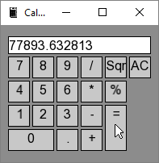

# CrankCalc

A simple calculator using the ScorpionGUI-library. The purpose was to test the library with a practical application as proof of concept. Main is loading the Form1 class which is inherited from GuiManager class. Once loaded the program enters the event loop. The loop handles the events and to update the GUI-controls, then render the window. When the form is about to load, you could add controls with the AddControl() function, then set its property with SetProperty(). We also set the form title and the application icon. In the event loop the form is calling UpdateControls() to handle events. Say if you, for instance clicked a button this would be where it triggered and then you decide what is going to happen by adding your code. With ScorpionGUI my goal was to make GUI-applications in similar fashions as done with C#. Sweet!

Tags: C++, SFML, UI, Project
